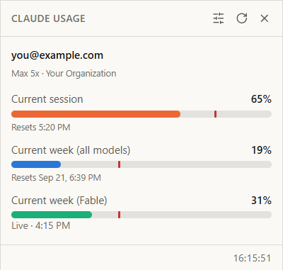

<h1 align="center">Claude Usage Widget</h1>

  Claude Code 사용량을 항상 화면에 띄워두는 위젯

  
  
  
  

  

  <a href="../README.md">English</a> · 한국어

`/usage`는 물어볼 때만 답을 줍니다. 이 위젯은 같은 수치를 계속 띄워둡니다. 5시간
세션 창, 주간 한도, 모델별 주간 한도, 그리고 각각의 초기화 시각까지 함께
보여줍니다.

## 기능

- **실시간 수치.** Claude Code가 쓰는 사용량 엔드포인트를 그대로 읽습니다.
  마지막으로 `/usage`를 친 시점의 캐시가 아니라 지금 값입니다. 하단에 마지막으로
  갱신된 시각이 적히고, 캐시를 보여주는 중이면 그 사실도 함께 적힙니다.
- **페이스 마커.** 막대 위의 빨간 선은 시간이 어디까지 흘렀는지를 나타냅니다.
  막대가 마커보다 앞서 있으면 초기화 전에 한도를 다 쓰게 됩니다.
- **Windows와 WSL 모두.** WSL 배포판 안에 설치된 것까지 포함해, 이 컴퓨터의 모든
  Claude Code 설치본을 찾습니다.
- **여러 계정.** 한도는 계정 단위입니다. 설치본들이 서로 다른 계정으로 로그인되어
  있으면 드롭다운으로 골라 볼 수 있습니다.
- **로그인 안 되어 있으면 버튼 하나로.** 자격 증명이 없으면 `claude login`을
  실행하는 버튼을 대신 보여줍니다.
- **거슬리지 않게.** 항상 위에 뜨고, 작업 표시줄에 남지 않고, 내용에 맞춰 창
  크기를 조절하며, Windows 라이트/다크 테마를 따릅니다.

## 설치

설치 파일을 받아 실행하면 됩니다.

| 파일 | 대상 |
| --- | --- |
| [claude-usage-widget_0.1.1_x64-setup.exe](https://github.com/1935138/claude-usage-widget/releases/download/v0.1.1/claude-usage-widget_0.1.1_x64-setup.exe) | 64비트 Windows |
| [claude-usage-widget_0.1.1_x86-setup.exe](https://github.com/1935138/claude-usage-widget/releases/download/v0.1.1/claude-usage-widget_0.1.1_x86-setup.exe) | 32비트 Windows |

Windows 11에는 WebView2 런타임이 이미 들어 있습니다. Windows 10이면 설치 과정에서
필요할 때 받아옵니다. 이전 버전과 `SHA256SUMS`는
[릴리스 페이지](https://github.com/1935138/claude-usage-widget/releases)에 있습니다.

Claude Code가 설치되어 있고 로그인되어 있어야 합니다. 그 외에 설정할 것은 없습니다.

## 사용법

제목 표시줄을 잡고 드래그하면 창이 움직이고, ✕로 닫습니다. 슬라이더 아이콘을
누르면 설정 패널이 열립니다.

| 설정 | 선택지 |
| --- | --- |
| 표시할 미터 | 현재 세션, 주간 한도 |
| 캐시·크레딧 정보 | 켜기 / 끄기 |
| 페이스 마커 | 켜기 / 끄기 |
| 갱신 주기 | 수동, 3분 ~ 1시간 (기본 5분) |
| 시계 | 표시 / 숨김 |
| 시간 표기 | 24시간(기본) / 12시간 |
| 모서리 | 각지게, 살짝, 둥글게(기본), 많이 둥글게 |

설정은 앱 설정 디렉터리의 `settings.json`에 저장되며 직접 편집해도 됩니다. 범위를
벗어난 값은 파일을 초기화하는 대신 불러올 때 교정되고, UTF-8 BOM이 붙어 있어도
읽습니다. `cornerRadius`는 패널에 없는 값이라도 24px까지 그대로 적용됩니다.

창에는 장식이 없고 배경이 투명합니다. Windows가 그려주는 테두리가 없기 때문에
카드가 스스로 외곽선을 그리며, **모서리** 설정이 그 모양을 결정합니다.

## 자격 증명

위젯은 Claude Code가 `~/.claude/.credentials.json`에 저장해 둔 OAuth **액세스**
토큰만 읽습니다. 그 파일에서 다른 것은 읽지 않습니다. **리프레시 토큰은 읽지도
쓰지도 않습니다.** 이 토큰은 Claude Code가 회전시키는 값이라, 다른 프로세스가
파일에 쓰면 Claude Code 쪽 로그인이 풀릴 수 있습니다. 액세스 토큰은 있는 그대로만
쓰고, 만료되면 Claude Code가 평소 사용 중에 갱신할 때까지 캐시 값을 보여줍니다.

수치를 가져오는 요청 하나를 빼면 이 컴퓨터 밖으로 나가는 것은 없습니다. 오류
값에는 자격 증명 파일의 내용이 담기지 않으므로 토큰이 로그나 화면에 새어 나갈 일이
없습니다. 같은 이유로 로그인도 위젯이 직접 처리하지 않고 별도 콘솔의
`claude login`에 맡깁니다.

## 개발

빌드 방법과 점검 명령은 [CONTRIBUTING.md](../CONTRIBUTING.md), 코드 구조와 그렇게
나눈 이유는 [docs/architecture.md](architecture.md)에 있습니다. 개발 문서는 영어로만
관리합니다.

## 라이선스

MIT. [LICENSE](../LICENSE)를 참고하세요.
